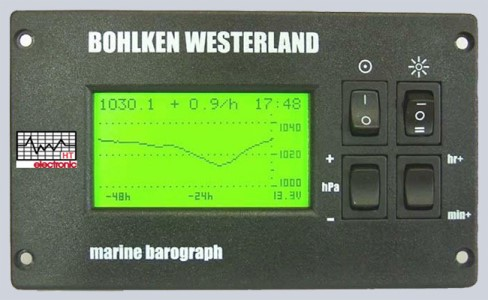

# signalk-barograph-plugin
SignalK Server plugin to record and visualize environmental data

## Install & Use
### Prerequisites
In order for this plugin to work you need to have InfluxDB available and configured - by using the latest __[JS client](https://influxdata.github.io/influxdb-client-js/influxdb-client.html)__ v2 API, the plugin supports both OSS version 1.8.4+ (32bit) and 2.0.x (64bit). Implementation may be in the same local network as SignalK server, hosted on docker or in the cloud.
- For v1.8 you may want to enable flux for the barograph despite influxql should work as a fallback
- Flux is defaulted on v2.0.x, but in order to use backwards compatibility on queries you may want to configure the __[1.x compatibility endpoint](https://docs.influxdata.com/influxdb/v2.0/reference/api/influxdb-1x/query/)__ 

### Install
Install the plugin from the SignalK Server appstore and configure as outline below. Post installation 'Activate' on the SignalK Plugin Config interface and enter your influx connection as well as application user data:

| Configuration | Influx v1.8.x | Influx OSS v2.x |
| ------------- | ------------- | --------------- |
| URI           | http(s)://url:port | http(s)://url:port |
| Token         | username:password | token       |
| Organisation  | empty         | required        |
| Bucket        | database/retentionpolicy | bucket          |

It is advised to have a default or explicit retention policy configured of at least 3h, better 6h.
*Note: Pointing to influxDB as http://localhost:8086 caused unreliable connection issues during test - you may want to use a fixed ip address instead.*

The selfref connection string points to a SignalK server user enabled for read/write in the following format:
`signalk-server-url including port|username|password`
The connection is used and required to provide configuration data from the plugin to the embedded web app (login as the same user)   

Use the write interval to configure data points **upload** interval to influx in seconds - read frequency is dependent on the path configuration (but will not below 1s) outlined in the next section.

### Sensor Configuration
This plugin focuses on capturing environmental data using influx - it is not intended to and will not record other data points (likewise navigation, performance, propulsion, electrical, etc.) despite the configuration supports any appropriately configured SignalK path. For more similarily specialized plugins see [tbd]. On plugin start a configuration file will be created in the plugin data directory which can be tailored to the sensors installed and configured. It has been tested with 
- __[signalk-raspberry-pi-bme280](https://www.npmjs.com/package/signalk-raspberry-pi-bme280)__
- __[Signal K Node server RuuviTag plugin](https://www.npmjs.com/package/signalk-ruuvitag-plugin)__

It is advised to have all paths connfigured underneith `environment` in a similar fashion in order to allow influx to automically create appropriate tags. In case path config isn't configurable, you can potentially re-config the path using the `config` attribute, eg.

| Path received from RUUVI-Tag | Path to be used for formatting points |
| ------------- | --------------- |
| `environment.outside.relativeHumidity` | `environment.outside.humidity` | 

### Paths Configuration
In order for the plugin, the app and predictions to work at a minimum the following four paths shall be present:

`{"path":"environment.outside.pressure","period":60000,"policy":"instant","minPeriod":30000,"trend":"pressure"}`

`{"path":"environment.outside.temperature","period":60000,"policy":"instant","minPeriod":30000,"trend":"temperature"}`

`{"path":"navigation.gnss.antennaAltitude","period":900000,"policy":"instant","minPeriod":30000,"trend":"altitude"}`

`{"path":"navigation.position","policy":"instant","trend":"position"}`

Additional paths can be configured in order to make more environmental data available in influx for analysis and visualization, eg.

`{"path":"environment.forecast.time","period":10000,"policy":"fixed"}`

`{"path":"environment.forecast.time.sunrise","period":900000,"policy":"fixed","convert":"dt|>s"}`

`{"path":"environment.forecast.time.sunset","period":900000,"policy":"fixed","convert":"dt|>s"}`

`{"path":"environment.inside.humidity","period":60000,"policy":"instant","minPeriod":30000}`

`{"path":"environment.outside.relativeHumidity","period":60000,"policy":"instant","minPeriod":30000,"config":"relativeHumidity|>humidity"}`

`{"path":"environment.forecast.humidity","period":900000,"policy":"fixed"}`

## Screen Samples
A working example of a full configuration file can be found __[here](./samples/pathconfig.json)__.

The embedded web app will try to adjust to available screen estate as much as possible:

| Main Screen | Mobile | Small |
| ------------- | ------------- | --------------- |
|  |  |  |

## Inspiration
The application is inspired by marine industry products like the __[Bohlken High Precision Barograph](http://www.bohlken.net/bg/bg1512_en.htm)__ or __[ASI Precision Digital Instruments DBX2](https://www.digitalbarograph.com/)__ by AquaTech Scientific Instruments. 

| Bohlken Westerland | ASI DBX2 | 
| ------------- | ------------- | 
|  |  |

## Details on Input, Predictions & Output
### Data Input & Transformation
The plugin subscribes to all `environment`-paths registered in `pathconfig.json`. It will create influx data points using a format transformation:

| environment | outside | pressure | value |
| ----------- | ------- | -------- | ----- |
| tag: name    | tag: value | measurement: name | measurement: value

| environment | forecast | wind | speed |
| ----------- | ------- | -------- | ----- |
| tag: name    | tag: value | measurement: name | measurement: value

The value given either in `uuid` or `mmsi` will be used as an additional tag to allow for multiple server instances logging into the same influx backend. Similarily the SignalK data source will be added as a tag to the point. Only a maximum of the most recent 3h of data are currently used within the Barograph App, however in future iterations the timeframe might be extended into 48h resp. 7d of weather monitoring through using additional buckets resp. RPs. Using retention policies and additional buckets the data can be easily downsampled for further analysis or longer-term storage.

### Predictions
In order to calculate & visualize predictions the __[barometer-trend package](https://www.npmjs.com/package/barometer-trend)__ created by __[github.com/oyve](https://github.com/oyve)__ is used and the same disclaimer applies. The 4 signalk-paths marked with `trend` are particularily required to create more accurate weather change forecast; for more information see also __[NOAA](https://globalocean.noaa.gov/News/sea-level-atmospheric-pressure-data-crucial-for-marine-weather-forecasts-says-new-study)__:
> Researchers used data from observing system experiments and forecast sensitivity observation impact analysis. Their report also states that improved marine weather forecasting enhances observations of atmospheric air circulation, which influences ocean surface waves, intensifying storms, and Earth’s water cycle. These data are used extensively for climate models, diagnostics, and indexes.
> 

### Output
For easy use within the app the plugin ejects a number of new `SignalK values`, such as: 

`environment.barometer.trend`

`environment.barometer.description`

`environment.barometer.prediction`

`environment.barometer.front.predicted`

`environment.barometer.wind.predicted`

None of these are tracked within influx.

## LICENSE
Copyright © 2024 Inspired Technologies GmbH. Rights Reserved.

This product depends on software developed at SignalK (https://signalk.org/index.html).
The Initial Developer of some parts of the framework are licensed under the Apache License, Version 2.0. 
Copyright 2015 Fabian Tollenaar, Teppo Kurki and Signal K committers

The oyve/barometer-trend libaray is licensed under the Apache License 2.0 and 
available for re-use at NPM (https://www.npmjs.com/package/barometer-trend)

The SignalK Barograph web application is provided subject to the following Terms of Use ("TOU"). Inspired Technologies reserves the right to update the TOU at any time without notice. Unless otherwise specified, the Software is for your personal and non-commercial use. You may not modify, copy, distribute, transmit, display, perform, reproduce, publish, license, create derivative works from, transfer, or sell any information, software, products or services obtained from the Software.
Any part of the software that is made available by downloading from NPM is the copyrighted work of Inspired Technolgies and/or its suppliers. Third party scripts or code, linked to or referenced from this website, are licensed to you by the third parties that own such code, not by Inspired Technologies.